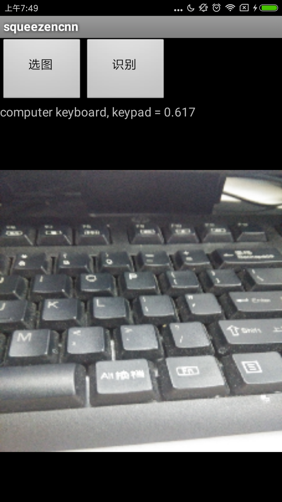
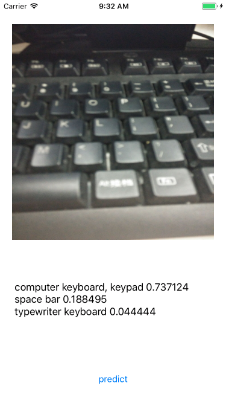

# ncnn-mobile
use [ncnn](https://github.com/Tencent/ncnn) in Android(Android Studio) and iOS 

Reference  
http://blog.csdn.net/best_coder/article/details/76201275  
https://github.com/Tencent/ncnn/issues/24

